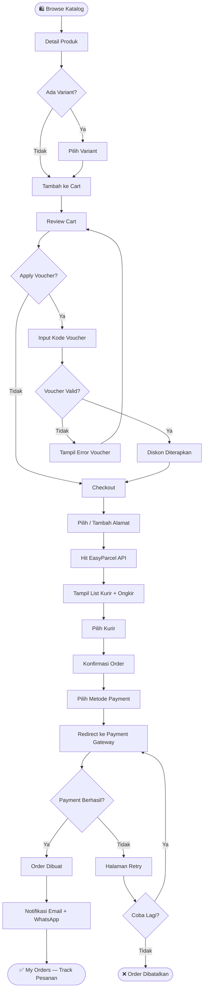
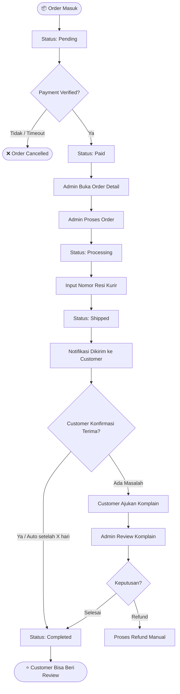
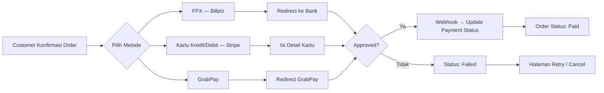

# Sistem Ecommerce Malaysia — Laravel + Filament
> Dokumentasi teknis: fitur, modul, flowchart, userflow, sitemap, use case, user persona

---

## 1. User Persona

### Persona 1 — Pembeli (Customer)

| Atribut | Detail |
|---|---|
| Nama | Siti Rahimah |
| Usia | 28 tahun |
| Lokasi | Kuala Lumpur, Malaysia |
| Pekerjaan | Pekerja swasta |
| Device | Mobile (Android), kadang laptop |
| Behavior | Sering belanja via Shopee, mulai coba toko independen |
| Pain point | Takut penipuan, mau tau ongkir dulu sebelum checkout, susah track pesanan |
| Goal | Belanja mudah, cepat, bisa pilih kurir, ada bukti transaksi jelas |

**Quote:** *"Kalau website susah dipakai atau ongkir nggak jelas, saya terus close je."*

---

### Persona 2 — Pemilik Toko (Admin)

| Atribut | Detail |
|---|---|
| Nama | Haziq bin Roslan |
| Usia | 34 tahun |
| Lokasi | Shah Alam, Selangor |
| Bisnis | Toko aksesori handphone online, baru mulai |
| Tech literacy | Sedang — pakai WhatsApp bisnis, familiar Shopee seller |
| Pain point | Kena komisi platform besar, susah manage stok, mau data sales sendiri |
| Goal | Punya toko sendiri, nggak bergantung marketplace, bisa manage order dari satu tempat |

**Quote:** *"Saya nak toko sendiri tapi tak mahu pening-pening dengan sistem complicated."*

---

## 2. Modul Sistem

### Frontend (Customer)

| Modul | Fitur |
|---|---|
| Auth | Register, login, forgot password, social login (optional), guest checkout |
| Home | Banner slider, produk featured, kategori highlight, promo, flash sale section |
| Katalog | Filter kategori/brand/harga, search, sort, pagination, live search + autocomplete |
| Produk | Galeri gambar, deskripsi, variant (warna/ukuran), stok live, review, related products, recently viewed, social share, notify me (restock alert), product Q&A |
| Cart | Tambah/hapus item, update qty, apply voucher, summary total, abandoned cart reminder |
| Checkout | Pilih/tambah alamat + address autocomplete, pilih kurir (EasyParcel API), summary, konfirmasi, SST/tax display |
| Payment | FPX, GrabPay, kartu kredit/debit via gateway (Billplz / Stripe), COD |
| Akun | Edit profil, kelola alamat, ganti password, loyalty points dashboard, referral code |
| My Orders | List order, detail order, status, tracking nomor resi, cancel order, return/refund request, download invoice PDF |
| Wishlist | Simpan produk, pindah ke cart |
| Review | Beri rating & ulasan setelah order complete |
| Notifikasi | Email konfirmasi order, update status via email/WhatsApp, restock alert, abandoned cart reminder |
| Flash Sale | Produk promo dengan countdown timer, limited qty, badge khusus |
| Pre-order | Produk belum ready bisa di-pre-order, notif otomatis saat ready |
| Product Bundle | Paket combo beberapa produk dengan harga spesial |
| Live Chat | WhatsApp floating button atau widget Crisp/Tawk.to |
| Newsletter | Form subscribe email untuk promo dan update toko |
| Multi-language | Toggle Bahasa Malaysia / English |

---

### Admin Panel (Filament)

| Modul | Fitur |
|---|---|
| Dashboard | Total revenue, order hari ini, produk stok rendah, grafik penjualan |
| Produk | CRUD produk, multi-gambar, variant, SKU, harga, stok, status, pre-order toggle |
| Kategori | Tree kategori, slug, gambar kategori |
| Brand | CRUD brand/merek |
| Bundle | Buat paket combo produk, set harga bundle, aktif/nonaktif |
| Flash Sale | Buat flash sale, set produk, harga promo, kuota, waktu mulai/selesai |
| Order | List order, filter status, update status, cetak invoice, detail, kelola return/refund |
| Customer | List customer, detail, riwayat order, poin loyalitas, suspend akun |
| Shipping | Konfigurasi EasyParcel, zona pengiriman, estimasi ongkir, setting COD |
| Payment | List transaksi, status payment, verifikasi manual transfer (approve/reject + bukti), refund manual |
| Voucher | Buat kode diskon (%, nominal, free shipping), limit penggunaan |
| Loyalty & Referral | Konfigurasi poin per transaksi, reward referral, riwayat penukaran poin |
| CMS | Kelola banner, halaman statis (about, FAQ, T&C), kelola Q&A produk |
| Newsletter | List subscriber, kirim broadcast email promo |
| Report | Sales report per periode, export Excel/PDF |
| Import/Export | Import produk & stok via Excel, export order/customer/payment/produk |
| Backup | Backup database + storage manual/otomatis, download & restore |
| Setting | Info toko, SST config, language config, **API Keys** (EasyParcel, Billplz, Stripe, Fonnte, dll), **Bank Accounts** (kelola rekening tujuan transfer manual) |
| User & Role | Kelola admin user, permission via Spatie |

---

## 3. Sitemap

```
/ (Home)
├── /products (Katalog)
│   └── /products/{slug} (Detail Produk)
├── /categories/{slug} (Produk per Kategori)
├── /flash-sale (Halaman Flash Sale)
├── /bundles (Halaman Product Bundle)
│   └── /bundles/{slug} (Detail Bundle)
├── /cart (Keranjang)
├── /checkout (Checkout)
│   └── /checkout/success (Order Berhasil)
├── /auth
│   ├── /login
│   ├── /register
│   ├── /forgot-password
│   └── /guest-checkout
├── /account (Dashboard Customer)
│   ├── /account/profile
│   ├── /account/addresses
│   ├── /account/orders
│   │   ├── /account/orders/{id}
│   │   ├── /account/orders/{id}/cancel
│   │   └── /account/orders/{id}/return
│   ├── /account/wishlist
│   ├── /account/points (Loyalty Points)
│   └── /account/referral
├── /pages/{slug} (Halaman statis: About, FAQ, T&C)
└── /admin (Filament Panel)
    ├── /admin/dashboard
    ├── /admin/products
    ├── /admin/categories
    ├── /admin/brands
    ├── /admin/bundles
    ├── /admin/flash-sales
    ├── /admin/orders
    ├── /admin/customers
    ├── /admin/vouchers
    ├── /admin/loyalty
    ├── /admin/newsletter
    ├── /admin/shipping
    ├── /admin/payments
    ├── /admin/cms/banners
    ├── /admin/reports
    ├── /admin/import-export
    ├── /admin/backup
    └── /admin/settings
```

---

## 4. Use Case

### UC-01: Beli Produk (Customer)

**Aktor:** Customer  
**Precondition:** Customer sudah login  
**Flow:**
1. Customer browse katalog / search produk
2. Buka halaman detail produk
3. Pilih variant (jika ada), klik "Tambah ke Cart"
4. Buka Cart, review item, apply voucher (opsional)
5. Klik "Checkout"
6. Pilih/tambah alamat pengiriman
7. Sistem hit EasyParcel API → tampil pilihan kurir + ongkir
8. Customer pilih kurir
9. Konfirmasi order, pilih metode payment
10. Redirect ke payment gateway
11. Payment berhasil → order dibuat, notifikasi email + WhatsApp
12. Customer bisa track order di "My Orders"

**Alternative Flow (Payment Gagal):**
- Step 10 gagal → tampil halaman retry
- Customer bisa coba ulang atau batalkan order

---

### UC-02: Kelola Order (Admin)

**Aktor:** Admin  
**Flow:**
1. Admin buka Order List di Filament panel
2. Filter order by status (Pending, Paid, Processing, Shipped, Completed)
3. Buka detail order
4. Update status ke "Processing"
5. Input nomor resi dari kurir
6. Update status ke "Shipped" → sistem kirim notifikasi ke customer
7. Customer konfirmasi terima → status "Completed"

---

### UC-03: Cek Ongkir (Customer)

**Aktor:** Customer  
**Flow:**
1. Customer masuk halaman Checkout
2. Input/pilih alamat tujuan
3. Sistem kirim request ke EasyParcel API dengan berat paket + alamat origin + tujuan
4. EasyParcel return list kurir (Pos Laju, J&T, DHL, Ninja Van, dll) + harga
5. Customer pilih kurir
6. Ongkir masuk ke total order

---

### UC-04: Buat Voucher (Admin)

**Aktor:** Admin  
**Flow:**
1. Admin buka modul Voucher
2. Input kode, tipe diskon (% atau nominal atau free shipping)
3. Set nilai, minimum order, batas penggunaan, tanggal expired
4. Simpan → voucher aktif dan bisa dipakai customer di cart

---

### UC-05: Lihat Report (Admin)

**Aktor:** Admin  
**Flow:**
1. Admin buka modul Report
2. Pilih periode (hari ini / minggu ini / bulan ini / custom)
3. Sistem generate: total revenue, jumlah order, produk terlaris, customer baru
4. Admin bisa export ke Excel atau PDF

---

## 5. Flowchart

### 5.1 Alur Checkout (Customer)



---

### 5.2 Alur Order Management (Admin)



---

### 5.3 Alur Payment (Detail)



---

## 6. Entity Relationship Diagram (ERD)

```mermaid
erDiagram
    users {
        bigint id PK
        string name
        string email
        string phone
        string password
        string role
    }

    addresses {
        bigint id PK
        bigint user_id FK
        string label
        string address
        string city
        string postcode
        string state
    }

    categories {
        bigint id PK
        bigint parent_id FK
        string name
        string slug
        string image
    }

    brands {
        bigint id PK
        string name
        string slug
    }

    products {
        bigint id PK
        bigint category_id FK
        bigint brand_id FK
        string name
        string slug
        text description
        decimal price
        boolean is_active
        string meta_title "nullable, fallback to name"
        text meta_description "nullable, fallback to description"
        string meta_keywords "nullable, opsional"
    }

    product_variants {
        bigint id PK
        bigint product_id FK
        string name
        string value
        decimal price_modifier
        int stock
        string sku
    }

    product_images {
        bigint id PK
        bigint product_id FK
        string path
        boolean is_primary
    }

    carts {
        bigint id PK
        bigint user_id FK
    }

    cart_items {
        bigint id PK
        bigint cart_id FK
        bigint product_id FK
        bigint variant_id FK
        int qty
    }

    orders {
        bigint id PK
        bigint user_id FK
        bigint address_id FK
        bigint voucher_id FK
        string status
        decimal total
        decimal shipping_cost
        string courier
        string tracking_no
    }

    order_items {
        bigint id PK
        bigint order_id FK
        bigint product_id FK
        bigint variant_id FK
        int qty
        decimal price
    }

    payments {
        bigint id PK
        bigint order_id FK
        string type "gateway atau manual"
        string method "billplz / stripe / grabpay / cod / manual_transfer"
        string status "pending / paid / failed / refunded"
        string reference
        decimal amount
        string proof_image "nullable, bukti transfer manual"
        timestamp verified_at "nullable, kapan admin verifikasi"
        bigint verified_by FK "nullable, admin yang verifikasi"
    }

    bank_accounts {
        bigint id PK
        string bank_name
        string account_name
        string account_number
        string logo "path logo bank"
        boolean is_active
        int sort
    }

    vouchers {
        bigint id PK
        string code
        string type
        decimal value
        decimal min_order
        int usage_limit
        int used_count
        timestamp expires_at
    }

    reviews {
        bigint id PK
        bigint user_id FK
        bigint product_id FK
        bigint order_id FK
        int rating
        text comment
    }

    banners {
        bigint id PK
        string title
        string image
        string link
        boolean is_active
        int sort
    }

    pages {
        bigint id PK
        string title
        string slug
        text content
    }

    settings {
        bigint id PK
        string key
        text value "encrypted untuk sensitive keys"
        string group "general / payment / shipping / notif / api"
        boolean is_encrypted
    }

    %% Relationships
    users ||--o{ addresses : "has"
    users ||--o{ orders : "places"
    users ||--o{ reviews : "writes"
    users ||--|| carts : "has"

    categories ||--o{ products : "has"
    categories ||--o{ categories : "parent of"
    brands ||--o{ products : "has"

    products ||--o{ product_variants : "has"
    products ||--o{ product_images : "has"
    products ||--o{ reviews : "receives"
    products ||--o{ order_items : "included in"
    products ||--o{ cart_items : "added to"

    carts ||--o{ cart_items : "contains"
    cart_items }o--o| product_variants : "specifies"

    orders ||--o{ order_items : "contains"
    orders ||--|| payments : "has"
    orders }o--|| addresses : "ships to"
    orders }o--o| vouchers : "uses"

    order_items }o--o| product_variants : "specifies"

    users ||--o{ reviews : "writes"
    products ||--o{ reviews : "receives"
```



---

## 7. Tech Stack & Arsitektur

| Layer | Teknologi |
|---|---|
| Backend | Laravel 12 |
| Admin Panel | Filament 3 |
| Frontend | Blade + Alpine.js + Tailwind CSS |
| Database | PostgreSQL / MySQL |
| Shipping | EasyParcel API |
| Payment | Billplz (FPX Malaysia) atau Stripe |
| Notifikasi | Mailable (email) + Fonnte/WhatsApp Business API |
| Storage | Laravel Storage (local dev) / S3 (production) |
| Queue | Laravel Queue + Redis (untuk notifikasi async) |
| Auth | Laravel Breeze / Fortify |
| Import/Export Excel | maatwebsite/excel (Laravel Excel) |
| Backup | spatie/laravel-backup |
| Multi-language | spatie/laravel-translatable atau mcamara/laravel-localization |
| Live Search | Algolia (via laravel/scout) atau Meilisearch |
| Live Chat | Crisp / Tawk.to (embed widget) |
| Address Autocomplete | Google Places API |
| PDF Invoice | barryvdh/laravel-dompdf |

---

## 8. Estimasi Development

| Fase | Scope | Estimasi |
|---|---|---|
| Fase 1 | Auth (+ guest checkout), Produk, Kategori, Admin CRUD | 1-2 minggu |
| Fase 2 | Cart, Checkout (+ SST, address autocomplete), EasyParcel, COD | 1 minggu |
| Fase 3 | Payment gateway, Order management, Invoice PDF | 1 minggu |
| Fase 4 | Customer account, My Orders, Cancel/Return/Refund, Notifikasi | 1 minggu |
| Fase 5 | Voucher, Flash Sale, Bundle, CMS, Live Search | 1-2 minggu |
| Fase 6 | Loyalty Points, Referral, Newsletter, Live Chat | 1 minggu |
| Fase 7 | Import/Export Excel, Backup, SEO, Multi-language | 1 minggu |
| Fase 8 | Pre-order, Product Q&A, Abandoned Cart, Polish UI | 1 minggu |
| **Total** | | **8-10 minggu** |

> **Catatan:** Fase 1-5 adalah MVP yang sudah layak launch. Fase 6-8 bisa dikerjakan post-launch secara bertahap.

---

## 9. Catatan Implementasi

- **EasyParcel:** Daftar di easyparcel.com/my → Individual API key → hit endpoint rate check saat checkout, book order setelah payment confirmed
- **Payment Malaysia:** Billplz paling gampang untuk FPX Malaysia (local transfer perbankan), biaya murah, integrasi mudah via package `billplz/billplz-laravel`
- **WhatsApp notif:** Bisa pakai Fonnte (yang kamu udah familiar) atau WhatsApp Business API langsung
- **Multi-image produk:** Pakai Filament `SpatieMediaLibraryFileUpload` atau custom upload dengan disk S3
- **Variant produk:** Pakai kombinasi attribute (Warna x Ukuran) → generate SKU otomatis
- **SEO:** Lihat detail di Section 10
- **Import/Export Excel:** Lihat detail di Section 11
- **Backup:** Lihat detail di Section 12

---

## 10. SEO Strategy

### Pendekatan: Auto-generate + Manual Override

Sistem SEO pakai dua lapis — auto-generate sebagai fallback, admin bisa override manual per produk via Filament. Admin awam tetap dapat SEO yang decent tanpa harus isi manual, tapi tetap ada kontrol penuh kalau mau push ranking produk tertentu.

---

### 10.1 Kolom Tambahan di Tabel `products`

| Kolom | Tipe | Keterangan |
|---|---|---|
| `meta_title` | `string\|null` | Jika null → auto-generate dari `name` |
| `meta_description` | `text\|null` | Jika null → auto-generate dari `description` |
| `meta_keywords` | `string\|null` | Opsional, kurang relevan di Google modern |

---

### 10.2 Logic Auto-generate (Blade / Service)

```php
// Helper / Service class
$metaTitle = $product->meta_title
    ?? $product->name . ' | ' . setting('site_name');

$metaDesc = $product->meta_description
    ?? Str::limit(strip_tags($product->description), 160);

$ogImage = $product->primaryImage?->path
    ?? asset('images/default-og.jpg');
```

---

### 10.3 Tags yang Di-render di `<head>`

```blade
{{-- Meta Basic --}}
<title>{{ $metaTitle }}</title>
<meta name="description" content="{{ $metaDesc }}">
@if($product->meta_keywords)
<meta name="keywords" content="{{ $product->meta_keywords }}">
@endif
<link rel="canonical" href="{{ url()->current() }}">

{{-- Open Graph (share ke WhatsApp / sosmed) --}}
<meta property="og:title" content="{{ $metaTitle }}">
<meta property="og:description" content="{{ $metaDesc }}">
<meta property="og:image" content="{{ $ogImage }}">
<meta property="og:url" content="{{ url()->current() }}">
<meta property="og:type" content="product">

{{-- Twitter Card --}}
<meta name="twitter:card" content="summary_large_image">
<meta name="twitter:title" content="{{ $metaTitle }}">
<meta name="twitter:description" content="{{ $metaDesc }}">
<meta name="twitter:image" content="{{ $ogImage }}">

{{-- Schema.org Product (Google Rich Results) --}}
<script type="application/ld+json">
{
  "@context": "https://schema.org/",
  "@type": "Product",
  "name": "{{ $product->name }}",
  "image": "{{ $ogImage }}",
  "description": "{{ $metaDesc }}",
  "sku": "{{ $product->variants->first()?->sku }}",
  "brand": {
    "@type": "Brand",
    "name": "{{ $product->brand?->name }}"
  },
  "offers": {
    "@type": "Offer",
    "price": "{{ $product->price }}",
    "priceCurrency": "MYR",
    "availability": "{{ $product->is_active ? 'https://schema.org/InStock' : 'https://schema.org/OutOfStock' }}"
  }
}
</script>
```

---

### 10.4 Sitemap XML

Gunakan package `spatie/laravel-sitemap`. Auto-generate include semua produk aktif, kategori, dan halaman statis.

```php
// routes/console.php atau Scheduler
SitemapGenerator::create(config('app.url'))
    ->hasCrawlingLimit(false)
    ->writeToFile(public_path('sitemap.xml'));
```

Atau custom sitemap manual buat kontrol lebih:

```php
$sitemap = Sitemap::create()
    ->add(Url::create('/'))
    ->add(
        Product::active()->get()->map(fn($p) =>
            Url::create("/products/{$p->slug}")
                ->setLastModificationDate($p->updated_at)
                ->setChangeFrequency(Url::CHANGE_FREQUENCY_WEEKLY)
                ->setPriority(0.8)
        )
    )
    ->add(
        Category::all()->map(fn($c) =>
            Url::create("/categories/{$c->slug}")
                ->setPriority(0.6)
        )
    )
    ->writeToFile(public_path('sitemap.xml'));
```

---

### 10.5 `robots.txt`

```
User-agent: *
Allow: /

Disallow: /admin
Disallow: /cart
Disallow: /checkout
Disallow: /account

Sitemap: https://yourdomain.com/sitemap.xml
```

---

### 10.6 Admin Panel — Form SEO di Filament

Tambahkan section **SEO** di form produk, collapsed by default biar tidak overwhelming:

```php
// ProductResource.php
Section::make('SEO')
    ->description('Kosongkan untuk auto-generate dari nama & deskripsi produk')
    ->collapsed()
    ->schema([
        TextInput::make('meta_title')
            ->label('Meta Title')
            ->placeholder('Otomatis: {nama produk} | {nama toko}')
            ->maxLength(70)
            ->helperText('Rekomendasi: 50–70 karakter'),

        Textarea::make('meta_description')
            ->label('Meta Description')
            ->placeholder('Otomatis: 160 karakter pertama dari deskripsi')
            ->maxLength(160)
            ->rows(3)
            ->helperText('Rekomendasi: 120–160 karakter'),

        TextInput::make('meta_keywords')
            ->label('Meta Keywords')
            ->placeholder('keyword1, keyword2, keyword3')
            ->helperText('Opsional. Pisah dengan koma.'),
    ])
```

---

### 10.7 Package yang Digunakan

| Package | Fungsi |
|---|---|
| `artesaos/seotools` | Handle meta tags, OG tags, Twitter Card via helper |
| `spatie/laravel-sitemap` | Generate sitemap.xml otomatis |

Install:
```bash
composer require artesaos/seotools spatie/laravel-sitemap
```

---

## 11. Import / Export Excel

### Package: `maatwebsite/excel` (Laravel Excel)

```bash
composer require maatwebsite/excel
```

---

### 11.1 Fitur Export

| Modul | File | Isi |
|---|---|---|
| Produk | `products_export.xlsx` | nama, slug, kategori, brand, harga, stok, status, SKU |
| Stok | `stock_export.xlsx` | nama produk, variant, SKU, stok saat ini |
| Order | `orders_export.xlsx` | ID order, customer, total, status, kurir, tanggal |
| Customer | `customers_export.xlsx` | nama, email, phone, total order, tanggal daftar |
| Payment | `payments_export.xlsx` | ID, order ID, metode, status, amount, tanggal |
| Report Sales | `sales_report_{periode}.xlsx` | revenue, jumlah order, produk terlaris per periode |

---

### 11.2 Fitur Import

| Modul | File | Keterangan |
|---|---|---|
| **Produk (bulk)** | `products_import.xlsx` | Import ratusan produk sekaligus — prioritas utama |
| **Update Stok** | `stock_update.xlsx` | Update stok massal via SKU |
| **Update Harga** | `price_update.xlsx` | Update harga massal via SKU |

---

### 11.3 Template Kolom Import Produk

File Excel yang di-upload admin harus mengikuti template berikut:

| Kolom | Wajib | Keterangan |
|---|---|---|
| `name` | ✅ | Nama produk |
| `category` | ✅ | Nama kategori (harus sudah ada di sistem) |
| `brand` | ❌ | Nama brand (opsional) |
| `description` | ❌ | Deskripsi produk |
| `price` | ✅ | Harga dasar (angka, tanpa simbol) |
| `is_active` | ❌ | 1 = aktif, 0 = nonaktif (default: 1) |
| `sku` | ❌ | Jika kosong, auto-generate |
| `stock` | ✅ | Stok awal |
| `variant_name` | ❌ | Misal: Warna, Ukuran |
| `variant_value` | ❌ | Misal: Merah, XL |
| `variant_price_modifier` | ❌ | Tambahan harga variant |
| `meta_title` | ❌ | SEO meta title (auto-generate jika kosong) |
| `meta_description` | ❌ | SEO meta desc (auto-generate jika kosong) |

---

### 11.4 Implementasi Export (Contoh: Order)

```php
// app/Exports/OrdersExport.php
class OrdersExport implements FromCollection, WithHeadings, WithMapping
{
    public function collection()
    {
        return Order::with(['user', 'payment'])->latest()->get();
    }

    public function headings(): array
    {
        return ['ID', 'Customer', 'Email', 'Total', 'Status', 'Kurir', 'Tanggal'];
    }

    public function map($order): array
    {
        return [
            $order->id,
            $order->user->name,
            $order->user->email,
            'RM ' . number_format($order->total, 2),
            $order->status,
            $order->courier,
            $order->created_at->format('d/m/Y'),
        ];
    }
}

// Di Filament Action
Action::make('export_orders')
    ->label('Export Excel')
    ->icon('heroicon-o-arrow-down-tray')
    ->action(fn() => Excel::download(new OrdersExport, 'orders_' . now()->format('Ymd') . '.xlsx'))
```

---

### 11.5 Implementasi Import (Contoh: Produk)

```php
// app/Imports/ProductsImport.php
class ProductsImport implements ToModel, WithHeadingRow, WithValidation, SkipsOnError
{
    public function model(array $row)
    {
        $category = Category::firstOrCreate(['name' => $row['category']]);
        $brand    = $row['brand'] ? Brand::firstOrCreate(['name' => $row['brand']]) : null;

        return new Product([
            'name'        => $row['name'],
            'slug'        => Str::slug($row['name']),
            'category_id' => $category->id,
            'brand_id'    => $brand?->id,
            'description' => $row['description'] ?? null,
            'price'       => $row['price'],
            'is_active'   => $row['is_active'] ?? 1,
        ]);
    }

    public function rules(): array
    {
        return [
            'name'  => 'required|string',
            'price' => 'required|numeric|min:0',
            'stock' => 'required|integer|min:0',
        ];
    }
}

// Di Filament Action
ImportAction::make()
    ->label('Import Produk')
    ->icon('heroicon-o-arrow-up-tray')
    ->importer(ProductsImport::class)
```

---

## 12. Backup System

### Package: `spatie/laravel-backup`

```bash
composer require spatie/laravel-backup
php artisan vendor:publish --provider="Spatie\Backup\BackupServiceProvider"
```

---

### 12.1 Apa yang Di-backup

| Komponen | Keterangan |
|---|---|
| **Database** | Full dump `.sql` — semua tabel |
| **Storage/Files** | Gambar produk, banner, file upload lainnya |
| **Output format** | `.zip` terenkripsi, disimpan ke disk yang dikonfigurasi |

---

### 12.2 Konfigurasi Destinasi Backup

```php
// config/backup.php
'destination' => [
    'disks' => [
        'local',   // dev: simpan di storage/app/backup
        's3',      // production: simpan ke S3 bucket terpisah
    ],
],

'cleanup' => [
    'strategy' => \Spatie\Backup\Tasks\Cleanup\Strategies\DefaultStrategy::class,
    'defaultStrategy' => [
        'keepAllBackupsForDays'            => 7,   // keep semua backup 7 hari terakhir
        'keepDailyBackupsForDays'          => 30,  // keep 1/hari untuk 30 hari
        'keepWeeklyBackupsForWeeks'        => 8,   // keep 1/minggu untuk 8 minggu
        'deleteOldestBackupsWhenUsingMoreMegabytesThan' => 2000,
    ],
],
```

---

### 12.3 Jadwal Backup Otomatis

```php
// routes/console.php
Schedule::command('backup:clean')->daily()->at('01:00');
Schedule::command('backup:run')->daily()->at('02:00');
```

---

### 12.4 Notifikasi Backup

```php
// config/backup.php
'notifications' => [
    'notifications' => [
        \Spatie\Backup\Notifications\Notifications\BackupHasFailed::class         => ['mail'],
        \Spatie\Backup\Notifications\Notifications\UnhealthyBackupWasFound::class => ['mail'],
        \Spatie\Backup\Notifications\Notifications\CleanupHasFailed::class        => ['mail'],
        \Spatie\Backup\Notifications\Notifications\BackupWasSuccessful::class     => ['mail'],
    ],
    'notifiable' => \Spatie\Backup\Notifications\Notifiable::class,
    'mail' => [
        'to' => 'admin@tokoku.com',
    ],
],
```

---

### 12.5 Admin Panel — Halaman Backup di Filament

Gunakan package `shuvroroy/filament-spatie-laravel-backup`:

```bash
composer require shuvroroy/filament-spatie-laravel-backup
```

Fitur yang tersedia di panel:
- Lihat list semua backup (nama file, ukuran, tanggal)
- Tombol **Backup Sekarang** (trigger manual)
- Tombol **Download** backup
- Tombol **Hapus** backup lama
- Status health check backup terakhir

```php
// AdminPanelProvider.php
->plugins([
    \ShuvroRoy\FilamentSpatieLaravelBackup\FilamentSpatieLaravelBackupPlugin::make()
        ->usingPage(Backup::class)
])
```

---

### 12.6 Alur Backup & Restore

```
[Otomatis] Scheduler jam 02:00
    ↓
backup:run → dump DB + zip storage
    ↓
Upload ke S3 (production) / local (dev)
    ↓
backup:clean → hapus file lama sesuai policy
    ↓
Notifikasi email: sukses / gagal

[Manual] Admin klik "Backup Sekarang" di panel
    ↓
Artisan::call('backup:run')
    ↓
File backup tersedia untuk download

[Restore] Via CLI (tidak dari panel, lebih aman)
    ↓
Download .zip dari S3
    ↓
Extract → restore DB via mysql/psql CLI
```

---

## 13. Feature Completeness & Roadmap

### 13.1 Prioritas Implementasi

| Prioritas | Fitur | Alasan |
|---|---|---|
| 🔴 MVP | Guest Checkout | Konversi drop tanpa ini — banyak customer malas register |
| 🔴 MVP | Order Cancellation (Customer) | Standar semua ecommerce, customer expect ini ada |
| 🔴 MVP | Return / Refund Request | Trust builder — customer lebih berani beli |
| 🔴 MVP | Invoice PDF | Dibutuhkan customer untuk claim warranty & rekap pribadi |
| 🔴 MVP | Live Search + Autocomplete | UX katalog, terutama toko yang produknya banyak |
| 🔴 MVP | SST / Tax Handling | Legal compliance Malaysia (SST 8%) |
| 🟡 Post-MVP | Flash Sale + Countdown | Fitur retention & urgency terkuat di ecommerce |
| 🟡 Post-MVP | Related Products | Naikkan average order value |
| 🟡 Post-MVP | Abandoned Cart Reminder | Recovery revenue yang sering diabaikan |
| 🟡 Post-MVP | COD | Masih relevan untuk buyer di luar Klang Valley |
| 🟡 Post-MVP | Social Share Produk | Free traffic dari WhatsApp/Facebook |
| 🟡 Post-MVP | Notify Me (Restock Alert) | Jaga lead produk OOS tetap warm |
| 🟡 Post-MVP | Live Chat (WhatsApp button) | Konversi naik signifikan dengan akses langsung ke seller |
| 🟢 v2 | Loyalty Points | Retention jangka panjang, repeat order |
| 🟢 v2 | Referral System | Akuisisi customer baru dengan biaya rendah |
| 🟢 v2 | Product Q&A | Trust builder, bantu customer yang ragu |
| 🟢 v2 | Newsletter | Email marketing list untuk broadcast promo |
| 🟢 v2 | Pre-order | Cocok untuk produk limited atau import |
| 🟢 v2 | Product Bundle | Naikkan AOV dengan combo deal |
| 🟢 v2 | Multi-language (MY/EN) | Reach lebih luas di Malaysia |
| 🟢 v2 | Address Autocomplete | UX checkout lebih smooth |

---

### 13.2 Tabel Database Tambahan

Fitur-fitur baru di atas membutuhkan tabel berikut:

| Tabel | Kolom Utama | Untuk Fitur |
|---|---|---|
| `flash_sales` | id, name, starts_at, ends_at, is_active | Flash Sale |
| `flash_sale_items` | id, flash_sale_id, product_id, variant_id, promo_price, quota | Flash Sale |
| `bundles` | id, name, slug, description, price, is_active | Product Bundle |
| `bundle_items` | id, bundle_id, product_id, variant_id, qty | Product Bundle |
| `returns` | id, order_id, user_id, reason, status, notes | Return/Refund |
| `return_items` | id, return_id, order_item_id, qty | Return/Refund |
| `loyalty_points` | id, user_id, points, type, ref_id, description | Loyalty Points |
| `referrals` | id, referrer_id, referee_id, code, reward_given | Referral System |
| `product_questions` | id, product_id, user_id, question, answer, is_published | Product Q&A |
| `restock_alerts` | id, product_id, variant_id, user_id, email, notified_at | Notify Me |
| `newsletter_subscribers` | id, email, name, subscribed_at, unsubscribed_at | Newsletter |
| `abandoned_carts` | id, cart_id, user_id, reminded_at, converted | Abandoned Cart |

---

### 13.3 Use Case Tambahan

#### UC-06: Guest Checkout
**Aktor:** Visitor (belum login)
**Flow:**
1. Visitor klik "Checkout sebagai Tamu"
2. Input nama, email, nomor HP
3. Input alamat pengiriman
4. Pilih kurir via EasyParcel
5. Pilih metode payment → proses seperti biasa
6. Order dibuat tanpa user_id (nullable), pakai email sebagai identifier
7. Email konfirmasi dikirim ke email guest
8. Guest bisa track order via link di email

---

#### UC-07: Return / Refund Request (Customer)
**Aktor:** Customer
**Precondition:** Order status = Completed
**Flow:**
1. Customer buka detail order di My Orders
2. Klik "Ajukan Return"
3. Pilih item yang mau diretur, isi alasan, upload foto bukti
4. Submit → status return: Pending
5. Admin review di panel, approve/reject
6. Jika approved → customer kirim barang balik
7. Admin konfirmasi barang diterima → proses refund manual
8. Status return: Completed

---

#### UC-08: Flash Sale (Admin + Customer)
**Aktor:** Admin (buat), Customer (beli)
**Flow Admin:**
1. Admin buka modul Flash Sale
2. Input nama, waktu mulai & selesai, produk + harga promo + kuota
3. Aktifkan → otomatis tampil di homepage saat waktunya

**Flow Customer:**
1. Customer lihat banner Flash Sale di homepage
2. Klik → halaman Flash Sale dengan countdown timer
3. Produk tampil dengan harga promo + badge + sisa kuota
4. Proses checkout normal
5. Jika kuota habis → produk ditandai "Sold Out"

---

#### UC-09: Abandoned Cart Reminder
**Aktor:** Sistem (otomatis)
**Flow:**
1. Customer tambah produk ke cart tapi tidak checkout dalam X jam (configurable, default: 3 jam)
2. Laravel Scheduler deteksi cart tidak aktif
3. Kirim email/WhatsApp reminder: "Kamu ada barang di cart!"
4. Jika customer balik dan checkout → cart ditandai converted
5. Jika tidak ada aksi dalam 24 jam → reminder ke-2 (opsional)

---

#### UC-10: Loyalty Points
**Aktor:** Customer
**Flow:**
1. Customer selesaikan order → status Completed
2. Sistem hitung poin: 1 poin per RM 1 yang dibayar (configurable)
3. Poin masuk ke akun customer
4. Di checkout, customer bisa pilih "Redeem poin" sebagai diskon
5. Konversi poin ke diskon dikonfigurasi admin (misal: 100 poin = RM 1)

---

### 13.4 Catatan Implementasi Fitur Baru

- **Guest Checkout:** Ubah `user_id` di tabel `orders` jadi nullable, tambah kolom `guest_email`, `guest_name`, `guest_phone`
- **SST Malaysia:** Tambah kolom `tax_rate` & `tax_amount` di tabel `orders`. Default 8%, bisa dinonaktifkan via Setting
- **Live Search:** Gunakan Meilisearch (self-hosted, gratis) via `laravel/scout` — lebih ringan dari Algolia untuk toko skala kecil-menengah
- **Invoice PDF:** Package `barryvdh/laravel-dompdf` — render Blade template ke PDF, download dari My Orders
- **COD:** Tambah payment method `cod` di tabel `payments`, order status langsung `Processing` tanpa perlu verifikasi payment gateway
- **Abandoned Cart:** Pakai Laravel Scheduler + Queue — cek cart yang tidak diupdate lebih dari X jam, kirim notif via email/WhatsApp
- **Flash Sale:** Gunakan Redis untuk real-time kuota tracking — hindari race condition saat banyak user checkout bersamaan
- **Address Autocomplete:** Google Places API (Places Autocomplete) — integrasi via Alpine.js di form checkout
- **Multi-language:** `mcamara/laravel-localization` — paling simpel, cukup buat konten statis. Konten produk bisa pakai `spatie/laravel-translatable` kalau mau bilingual per produk

---

## 14. Payment System (Manual + Gateway)

### 14.1 Dua Jenis Payment

| Jenis | Method | Keterangan |
|---|---|---|
| **Gateway (Otomatis)** | Billplz (FPX) | Redirect ke payment page, verified otomatis via webhook |
| **Gateway (Otomatis)** | Stripe | Kartu kredit/debit, verified otomatis |
| **Gateway (Otomatis)** | GrabPay | Redirect ke GrabPay, verified otomatis |
| **Gateway (Otomatis)** | COD | Bayar di tempat, status paid saat kurir konfirmasi |
| **Manual Transfer** | Bank Transfer | Customer transfer ke rekening toko, upload bukti, admin verifikasi |

---

### 14.2 Tabel `bank_accounts`

Admin bisa tambah/hapus/edit rekening bank dari panel — tidak perlu update `.env` atau kode.

| Kolom | Tipe | Keterangan |
|---|---|---|
| `id` | bigint PK | |
| `bank_name` | string | Nama bank (Maybank, CIMB, RHB, dll) |
| `account_name` | string | Nama pemegang rekening |
| `account_number` | string | Nomor rekening |
| `logo` | string | Path logo bank |
| `is_active` | boolean | Aktif/nonaktif tampil di checkout |
| `sort` | integer | Urutan tampil di checkout |

---

### 14.3 Alur Manual Transfer (Customer)

```
Customer pilih "Bank Transfer" di checkout
    ↓
Tampil daftar rekening bank aktif (dari tabel bank_accounts)
Customer pilih bank tujuan
    ↓
Order dibuat → status: Pending Payment
    ↓
Customer transfer ke rekening yang dipilih
    ↓
Customer upload bukti transfer di halaman My Orders
    ↓
Status order: Waiting Verification
    ↓
Admin terima notifikasi (email/WhatsApp) → ada order perlu diverifikasi
    ↓
Admin buka panel → lihat bukti transfer → Approve / Reject
  → Approve: status order → Paid → lanjut proses normal
  → Reject: notif ke customer, order kembali ke Pending Payment
            customer bisa upload ulang bukti
```

---

### 14.4 Kolom Tambahan di Tabel `payments` untuk Manual Transfer

| Kolom | Tipe | Keterangan |
|---|---|---|
| `type` | enum | `gateway` atau `manual` |
| `proof_image` | string\|null | Path foto bukti transfer (upload customer) |
| `verified_at` | timestamp\|null | Waktu admin verifikasi |
| `verified_by` | bigint\|null FK | ID admin yang verifikasi |
| `rejection_reason` | string\|null | Alasan reject jika ditolak |

---

### 14.5 Di Filament — Verifikasi Manual Transfer

```php
// Di OrderResource atau PaymentResource
Action::make('verify_payment')
    ->label('Verifikasi Transfer')
    ->visible(fn($record) => $record->payment->type === 'manual' 
        && $record->payment->status === 'pending')
    ->form([
        ViewField::make('proof')
            ->view('filament.components.payment-proof'), // tampil gambar bukti
        Textarea::make('rejection_reason')
            ->label('Alasan Tolak (isi jika reject)')
            ->nullable(),
    ])
    ->action(function ($record, $data, $action) {
        if ($action === 'approve') {
            $record->payment->update([
                'status'      => 'paid',
                'verified_at' => now(),
                'verified_by' => auth()->id(),
            ]);
            $record->update(['status' => 'paid']);
            // kirim notif ke customer
        } else {
            $record->payment->update([
                'status'           => 'failed',
                'rejection_reason' => $data['rejection_reason'],
            ]);
            // kirim notif ke customer untuk upload ulang
        }
    })
```

---

## 15. API Key Configuration (Admin Panel)

### 15.1 Konsep

Semua API key & konfigurasi third-party disimpan di tabel `settings` — bukan di `.env`. `.env` hanya untuk config infrastructure (DB credentials, App Key, Redis URL). Config yang sering berubah atau perlu diakses admin dikelola dari panel.

---

### 15.2 Struktur Tabel `settings` (Updated)

| Kolom | Tipe | Keterangan |
|---|---|---|
| `id` | bigint PK | |
| `key` | string unique | Identifier setting, e.g. `easyparcel_api_key` |
| `value` | text\|null | Nilai setting, dienkripsi jika sensitif |
| `group` | string | Grouping: `general`, `payment`, `shipping`, `notification`, `api`, `sst` |
| `is_encrypted` | boolean | Jika true, value disimpan dengan `encrypt()` Laravel |
| `label` | string | Label human-readable untuk tampil di panel |
| `description` | string\|null | Helper text di bawah field |

---

### 15.3 Daftar Semua Settings Key

#### Group: `general`
| Key | Label | Keterangan |
|---|---|---|
| `site_name` | Nama Toko | |
| `site_logo` | Logo Toko | |
| `site_favicon` | Favicon | |
| `site_email` | Email Toko | |
| `site_phone` | Nomor HP Toko | |
| `site_address` | Alamat Toko | Untuk origin pengiriman EasyParcel |
| `site_language` | Bahasa Default | `my` atau `en` |

#### Group: `sst`
| Key | Label | Keterangan |
|---|---|---|
| `sst_enabled` | Aktifkan SST | Boolean |
| `sst_rate` | Rate SST (%) | Default: 8 |
| `sst_label` | Label Tampil | Default: "SST (8%)" |

#### Group: `payment`
| Key | Label | Encrypted |
|---|---|---|
| `billplz_api_key` | Billplz API Key | ✅ |
| `billplz_collection_id` | Billplz Collection ID | ✅ |
| `billplz_x_signature` | Billplz X-Signature | ✅ |
| `billplz_sandbox` | Billplz Sandbox Mode | ❌ |
| `stripe_publishable_key` | Stripe Publishable Key | ❌ |
| `stripe_secret_key` | Stripe Secret Key | ✅ |
| `stripe_webhook_secret` | Stripe Webhook Secret | ✅ |
| `stripe_sandbox` | Stripe Test Mode | ❌ |
| `grabpay_enabled` | Aktifkan GrabPay | ❌ |
| `cod_enabled` | Aktifkan COD | ❌ |
| `manual_transfer_enabled` | Aktifkan Manual Transfer | ❌ |
| `manual_transfer_deadline_hours` | Batas Waktu Upload Bukti (jam) | ❌ |

#### Group: `shipping`
| Key | Label | Encrypted |
|---|---|---|
| `easyparcel_api_key` | EasyParcel API Key | ✅ |
| `easyparcel_sandbox` | EasyParcel Sandbox Mode | ❌ |
| `store_postcode` | Postcode Asal Pengiriman | ❌ |
| `store_state` | State Asal Pengiriman | ❌ |

#### Group: `notification`
| Key | Label | Encrypted |
|---|---|---|
| `mail_host` | SMTP Host | ❌ |
| `mail_port` | SMTP Port | ❌ |
| `mail_username` | SMTP Username | ✅ |
| `mail_password` | SMTP Password | ✅ |
| `mail_from_address` | From Email | ❌ |
| `mail_from_name` | From Name | ❌ |
| `fonnte_token` | Fonnte Token | ✅ |
| `fonnte_sender` | Nomor WhatsApp Pengirim | ❌ |
| `whatsapp_enabled` | Aktifkan WhatsApp Notif | ❌ |

#### Group: `api`
| Key | Label | Encrypted |
|---|---|---|
| `google_places_api_key` | Google Places API Key | ✅ |
| `google_analytics_id` | Google Analytics ID | ❌ |
| `facebook_pixel_id` | Facebook Pixel ID | ❌ |
| `crisp_website_id` | Crisp Website ID | ❌ |

---

### 15.4 Helper Function

```php
// app/Helpers/SettingHelper.php

function setting(string $key, $default = null): mixed
{
    return cache()->rememberForever("setting:{$key}", function () use ($key, $default) {
        $setting = \App\Models\Setting::where('key', $key)->first();

        if (!$setting) return $default;

        return $setting->is_encrypted
            ? decrypt($setting->value)
            : $setting->value;
    });
}

function setting_bool(string $key, bool $default = false): bool
{
    return filter_var(setting($key, $default), FILTER_VALIDATE_BOOLEAN);
}
```

Cache di-clear otomatis via Observer saat nilai setting diupdate:

```php
// app/Observers/SettingObserver.php
class SettingObserver
{
    public function saved(Setting $setting): void
    {
        cache()->forget("setting:{$setting->key}");
    }
}
```

---

### 15.5 Filament Settings Page

Gunakan grouping per tab biar admin tidak overwhelmed:

```php
// app/Filament/Pages/Settings.php
class Settings extends Page
{
    protected static string $view = 'filament.pages.settings';

    public function form(Form $form): Form
    {
        return $form->schema([
            Tabs::make('Settings')->tabs([

                Tab::make('Umum')->schema([
                    TextInput::make('site_name')->label('Nama Toko'),
                    FileUpload::make('site_logo')->label('Logo'),
                    TextInput::make('site_email')->label('Email Toko')->email(),
                    TextInput::make('site_phone')->label('No. HP'),
                ]),

                Tab::make('Payment')->schema([
                    Toggle::make('manual_transfer_enabled')->label('Aktifkan Manual Transfer'),
                    Toggle::make('cod_enabled')->label('Aktifkan COD'),
                    Section::make('Billplz')->schema([
                        Toggle::make('billplz_sandbox')->label('Sandbox Mode'),
                        TextInput::make('billplz_api_key')->label('API Key')->password()->revealable(),
                        TextInput::make('billplz_collection_id')->label('Collection ID'),
                        TextInput::make('billplz_x_signature')->label('X-Signature Key')->password()->revealable(),
                    ]),
                    Section::make('Stripe')->schema([
                        Toggle::make('stripe_sandbox')->label('Test Mode'),
                        TextInput::make('stripe_publishable_key')->label('Publishable Key'),
                        TextInput::make('stripe_secret_key')->label('Secret Key')->password()->revealable(),
                        TextInput::make('stripe_webhook_secret')->label('Webhook Secret')->password()->revealable(),
                    ]),
                ]),

                Tab::make('Pengiriman')->schema([
                    Toggle::make('easyparcel_sandbox')->label('Sandbox Mode'),
                    TextInput::make('easyparcel_api_key')->label('EasyParcel API Key')->password()->revealable(),
                    TextInput::make('store_postcode')->label('Postcode Toko'),
                    Select::make('store_state')->label('State')->options(MalaysiaStates::all()),
                ]),

                Tab::make('Notifikasi')->schema([
                    Section::make('Email (SMTP)')->schema([
                        TextInput::make('mail_host')->label('SMTP Host'),
                        TextInput::make('mail_port')->label('Port'),
                        TextInput::make('mail_username')->label('Username'),
                        TextInput::make('mail_password')->label('Password')->password()->revealable(),
                        TextInput::make('mail_from_address')->label('From Email'),
                        TextInput::make('mail_from_name')->label('From Name'),
                    ]),
                    Section::make('WhatsApp (Fonnte)')->schema([
                        Toggle::make('whatsapp_enabled')->label('Aktifkan WhatsApp Notif'),
                        TextInput::make('fonnte_token')->label('Fonnte Token')->password()->revealable(),
                        TextInput::make('fonnte_sender')->label('Nomor Pengirim'),
                    ]),
                ]),

                Tab::make('SST')->schema([
                    Toggle::make('sst_enabled')->label('Aktifkan SST'),
                    TextInput::make('sst_rate')->label('Rate SST (%)')->numeric(),
                    TextInput::make('sst_label')->label('Label Tampil'),
                ]),

                Tab::make('API Lainnya')->schema([
                    TextInput::make('google_places_api_key')->label('Google Places API Key')->password()->revealable(),
                    TextInput::make('google_analytics_id')->label('Google Analytics ID'),
                    TextInput::make('facebook_pixel_id')->label('Facebook Pixel ID'),
                    TextInput::make('crisp_website_id')->label('Crisp Website ID'),
                ]),

            ]),
        ]);
    }
}
```
